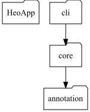

# heo-cli

Tools to analyze package-level structure and visualize it

## install

Download the latest jar file from the [release](https://github.com/heowc/heo/releases)

This tool relies on [graphviz](https://graphviz.org/). Please install graphviz first.

## usage

- `d`: Enter the directory path.
- `p`: Enter the package path.
- `o`: (optional) Enter the destination file path.
- `failure-on-cycles`: (optional) Enter whether to fail if a cycle occurs between modules.

```bash
java -jar heo-cli-0.0.2.jar -d /Users/heowc/Projects/heo -p dev.heowc.heo
```

```text
$ java -jar heo-cli-0.0.2.jar -d /Users/heowc/Projects/heo-core -p dev.heowc.heo.core
 __   __  _______  _______
|  | |  ||       ||       |
|  |_|  ||    ___||   _   |
|       ||   |___ |  | |  |
|       ||    ___||  |_|  |
|   _   ||   |___ |       |
|__| |__||_______||_______|

2024-05-01T17:23:52.031+09:00  INFO 72099 --- [           main] c.h.h.c.l.a.ModuleLoaderService          : Loading dev.heowc.heo from ./
2024-05-01T17:23:52.044+09:00  INFO 72099 --- [           main] c.h.h.c.a.a.DependencyAnalysisService    : Analysing project dependencies for modules. size=0
2024-05-01T17:23:52.445+09:00  INFO 72099 --- [           main] c.h.h.c.v.ReportVisualizationService     : Report file created  (file:///Users/heowc/Projects/heo/result-1714551832030.png)
```

## Result



# heo-gradle-plugin

A gradle plugin is provided for easier use.

## usage

```groovy
plugins {
    id "dev.heowc.deo" version "0.0.2"
}

heo {
    directoryPath = "${rootDir}/heo-core" // The default is to use the root path.
    prefixPackage = "dev.heowc.heo.core" // The default is group.
    // destination // By default, the `reports/heo/index.png` image file is created under the build path.
    // failure-on-cycles // The default option is disabled, 
                         // and if enabled the task will fail if a cycle occurs.
}
```

Please note that there is a [test](it/gradle-plugin/build.gradle) for the plugin.

# What's next

- Support native
  - See https://github.com/oracle/graal/issues/8273
- Support plugin (~~gradle~~, maven etc)
